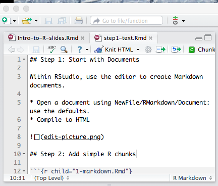
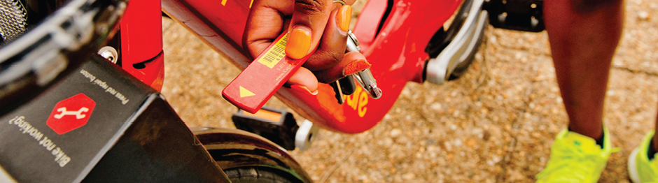

## R for Python People

```{r engine='python'}
print("Hello, Data^3 Python People!")
```

```{r}
"And to you also, R Folks!"
```

I'm orienting this talk to people who are familiar with programming ... but not necessarily either R or Python.

## Tips for Getting Started

#. Where to start?
#. How to move forward?
#. What should I skip until I need it?

## Many, many resources

* **c<>de school** <http://tryr.codeschool.com/>
* *The Art of R Programming* Norman Matloff
* *Introduction to R* Michael Clark <http://www3.nd.edu/~mclark19/learn/Introduction_to_R.pdf>
* <http://www.johndcook.com/blog/r_language_for_programmers/>
* <http://en.wikibooks.org/wiki/R_Programming/Introduction>
* *An Introduction to R* Venables, Smith & R Core Team

## My approach today

You can read the previously listed resources at any time.  

Little point in my repeating them here.

**Instead ...**

An unconventional introduction ... 

* Cover the minimum of language constructs and issues
* Provide support for doing actual work
* Get you going quickly so that you can learn more by reading examples.

presentation sources at    
<http://github.com/dtkaplan/Data-3-Conference>


```{r include=FALSE}
knitr::opts_chunk$set(comment=NA, tidy=FALSE)
options(width=66)
```

## Ten Starting Steps

<div class="columns-2">

### Preliminaries

-  1: Start with documents
-  2: Simple R chunks within documents
-  3: Atomic types 
-  4: Assignment & naming (trivial)
-  5: Vectors
-  6: Packages

&nbsp;

&nbsp;

&nbsp;

### Data Science

-  7: Data frames
-  8: Wrangling
-  9: Graphics
- 10: ~~Programming constructs~~

### Now you're ready to

* read other people's examples and documentation
* copy and modify to your own purposes

&nbsp;

&nbsp;
</div>

## Step 1: Start with Documents

<div class="columns-2">
Within RStudio, use the editor to create Markdown documents.

* Open a document using NewFile/RMarkdown/Document: use the defaults.
* Compile to HTML

&nbsp;

&nbsp;

&nbsp;



```{r eval=FALSE,echo=FALSE, comment=NA}
cat(paste(readLines("0-markdown.Rmd"), collapse="\n"))
```

</div>

------------------

<div class="columns-2">

```{r child="0-markdown.Rmd"}
```

```{r echo=FALSE, comment=NA}
cat(paste(readLines("0-markdown.Rmd"), collapse="\n"))
```

</div>

## Step 2: Add simple R chunks

<div class="columns-2">

```{r child="1-markdown.Rmd"}
```

```{r echo=FALSE, comment=NA}
cat(paste(readLines("1-markdown.Rmd"), collapse="\n"))
```

</div>

## Step 3: "Atomic" types

String | Numeric | Logical
-------|---------|--------
`"Hello, World!"` | `5`, `3.76`, `1.2e12` | `TRUE`, `FALSE`


type | basic operators
--------|---------------------
strings | manipulation: `paste()`, `tolower()` 
&nbsp;  | comparison: `== > < <= >=`
numbers | arithmetic: `+ - * / %%` and so on
&nbsp;  | mathematical, e.g. `sin()`
&nbsp;  | comparison `> < == <= >=`
logical | `| & ! xor()`

## Step 4: Assignment and Naming

People in the audience already know about objects, object names, and assignment.

```{r}
x <- 3 + 4
country_name <- "Italy"
position3 <- 17
```

But not ~~`country name`~~ or ~~`3position`~~

Named arguments are like Python optional arguments, e.g.
`seq(0, 5, length=26)` 

## Step 5: Vectors

```{r}
my_vec <- c(4, 5, 6)
sqrt(my_vec)
sum(my_vec)
paste("Person", my_vec)
```

-----------------

### An Important Distinction

**Reduction Functions**:    
Reduce a vector to a single element
`mean()`, `max()`, `min()`, `sd()`, `sum()`, `all()`, `any()`

**Transformation Functions**: 
Operate on each element of a vector

* Unary: `sqrt()`, `sin()`, etc.
* Binary: `+ / - * ^ == > <`, etc. 

Element-by-element combination of a vector and a scalar or of a vector with a vector, e.g.
```{r}
my_vec ^ sqrt(my_vec)
```


## Step 6: Packages

To use installed packages:

1. `library(dplyr)` --- access to everything in package
#. `dplyr::mutate()` --- access to one function

For upcoming examples:

```{r message=FALSE}
library(dplyr) # for wrangling 
library(ggplot2) # for graphics 
library(leaflet) # for maps
library(rvest) # for html/xml scraping
```

--------------------------

### To install

Vetted packages on "CRAN"  and many others on, e.g. GitHub

A one-time operation.

1. RStudio tab: Packages/Install for CRAN.
2. From e.g. GitHub:  `devtools::install_github("dtkaplan/mosaic")`

## Step 7: Data 

Data Frame: a collection of vectors, each of the same length.  This represents a rectangular "spreadsheet" array of data.

```{r}
head(mtcars, 2)
nrow(mtcars)
names(mtcars)
with(mtcars, mean(mpg))
```

For quick look: `str(mtcars)`, `summary(mtcars)`, `View(mtcars)`

----------------------------------------

Read in data from 

* tidy CSV files. (Scraping for later.)
```r
options(stringsAsFactors=FALSE)
MyData <- read.csv(file.choose()) # one off
MyData <- read.csv("~//Talks/2015-03-07-Data3/bikedata.csv")
MyData <- read.csv(
      url("http://www/mosaic-web.org/go/datasets/CPS85.csv")
  )
```
* package data (for learning, testing, ...)
```r
mosaicData::Births78
```

----------------------------------------

Example: Capital BikeShare



Bike sharing system in Washington, DC.

* 375 stations
* publishes historical data on each bike trip
* publishes real-time XML on bike/space availability.

----------------------------------------

```{r eval=FALSE}
BikesRaw <- read.csv("BikeShare/2014-Q4-Trips-History-Data.csv")
# Bikes is lightly cleaned: see below
head(Bikes,2)
```
```{r echo=FALSE, cache=TRUE}
load("BikeShare/2014-Q4-Trips-History-Data.rda")
head(Bikes,2) %>% select(sdate, sstation, bikeno) 
```
```{r}
names(Bikes)
```

## Step 8: Data Wrangling

Start with `dplyr` package. Provides concise interface to relational operations.

### Data verbs

Data verbs take a data frame as input and return a data frame as output.

* `filter()` --- selects by criteria
* `summarise()` --- aggregates
* `group_by()` --- sets reduction operations by groups
* `inner_join()` and other joins --- combine two tables
* `mutate()` --- creates new variables from old

Others: `arrange()`, `select()`, `sample_n()`, ...

------------

Task: Count number of bikes picked up at each station
```{r}
PickedUp <-
  Bikes %>% 
  group_by(sstation) %>% 
  summarise(picked_up = n()) 
DroppedOff <-
  Bikes %>% 
  group_by(estation) %>%
  summarize(dropped_off = n())
Activity <-
  inner_join(PickedUp, DroppedOff, by=c("sstation"="estation")) %>%
  arrange(desc(picked_up))
```
```{r echo=FALSE}
head(Activity) %>% as.data.frame
```


## Step 9: Graphics

Start with `ggplot2` package.

* `ggplot()` defines a "frame"
* `aes()` maps variables to graphical attributes
* geom set the glyph type

----------------------

```{r}
Activity %>%
  ggplot(aes(x = rank(picked_up), y = picked_up)) +
  geom_point(color = "blue") + 
  geom_point( aes(y = dropped_off), color = "red") +
  scale_y_log10()
```

-------------------------

```{r tidy=FALSE, out.height="350px"}
Bikes %>%
  mutate(dur = as.numeric(edate - sdate) / 60) %>% 
  filter(dur > 0, dur < 120) %>% 
  ggplot(aes(x = dur)) + 
  geom_density(alpha=0.4, fill="gray") + 
  xlab("Duration of rental (minutes)") +
  ggtitle("The first 30 minutes are free!") + 
  geom_vline(x=30, color="red")
```

--------------------------
```{r out.height="350px"}
Bikes %>%
  mutate(week_end = weekdays(sdate, TRUE) %in% c("Sat", "Sun"),
         hour = lubridate::hour(sdate) ) %>%
  group_by(hour, week_end) %>%
  summarise(count = n()) %>%
  ggplot(aes(x = hour, y = count, group = week_end)) +
  geom_line(aes(color = week_end))
```


## Step 10: Programming constructs

1. Conditionals `ifelse(count > 100, "big","small")`
2. Functions `f <- function(x) {x^2}`
2. Loops `for (s in stations) {` do something with s `}`
2. Indexing 
3. Matrices
4. Lists

--------------------

Scraping the XML station data

```
<stations lastUpdate="1425503108846" version="2.0">
  <station> 
    <name>20th &amp; BellSt</name> 
    <lat>38.8561</lat><long>-77.0512</long>
    <nbBikes>7</nbBikes><nbEmptyDocks>4</nbEmptyDocks>
  </station>
  ...
```


```{r}
myvars <- function(station) { 
    xml_nodes(station, 
              xpath=c("lat","long","nbbikes","nbemptydocks","name")
    ) %>% xml_text     }

station_nodes <- xml("BikeShare/bikeStations.xml") %>% 
                 xml_nodes("station")
Stations <- 
  sapply(station_nodes, myvars) %>% t %>% 
  data.frame(stringsAsFactors=FALSE)
names(Stations) <- c("name","lat","long","nbBikes","nbEmptyDocks")
```


## Read examples and imitate

A map of bicycle sharing stations showing 

* availability of bikes
* empty docks to return bikes.

```{r message=FALSE}
stationMap <- 
  leaflet(Stations) %>%   # like ggplot()
  addTiles() %>%          # add the map
  setView(-77.04, 38.9, zoom=12) %>%
  addCircleMarkers(radius=Stations$nbBikes) %>%
  addCircleMarkers(radius=pmax(0,Stations$nbEmptyDocks), color="red")
```

---------------------

`r stationMap`


